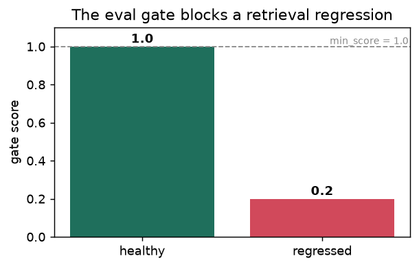
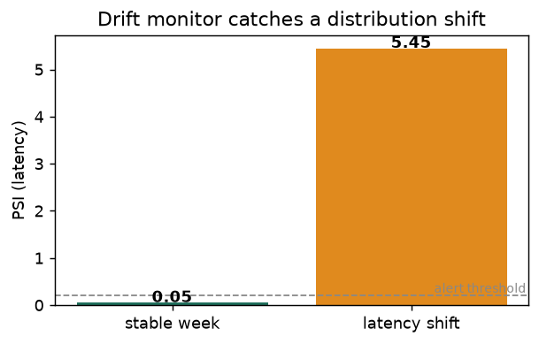

# Skein Lite

[](https://github.com/hoomanesteki/agentic-rag-knowledge-ai-platform/actions/workflows/ci.yml)

**[Read the showcase →](https://hoomanesteki.github.io/agentic-rag-knowledge-ai-platform/)**:
architecture, evaluation, the decisions behind it, and an honest look at the failure modes. The
site's source is in [`showcase/`](showcase/) (Quarto, rendered to GitHub Pages by CI).

A local-first, **domain-swappable agentic RAG platform**. It answers over a mix of structured and
unstructured data, cites every answer (or honestly says it does not know), and routes each turn
through a **master orchestrator** to the right specialist, handing off to a human when unsure.

**One engine, any topic:** a new domain is a config folder, not code. Tests and CI run fully
offline on fakes; the models (Groq, Cohere) and stores (Qdrant, DuckDB, Neo4j) are config swaps.

## What it does

- **Grounded or honest.** Hybrid retrieval (dense + sparse, RRF) with a reranker, sentence-level
  citation checks, and an abstain gate. Retrieved text is sanitized against prompt injection.
- **A master orchestrator, not a prompt.** The default brain (`CHAT_BRAIN=omni`) routes each turn to
  a specialist lane, shopping (Sara), care, complaint, answers, or escalation (Tiffany), all sharing
  **one gated pipeline**, so specialization sharpens tone, never safety. Free deterministic layers
  handle most turns (81.6%); a cheap 8B tie-break lifts the rest to 85.9% with 100% escalation
  recall. (A `linear` and a LangGraph `agent` brain are also selectable.) Diagram below.
- **Guards that do not trust the model.** Order PII, prompt injection, customer enumeration, and
  gender-correct recommendations are enforced deterministically in code, before the prompt. See
  [the guardrails](#guardrails-enforced-in-code-not-in-the-prompt).
- **A real data stack.** The medallion (bronze, silver, gold) is modeled in **dbt** with schema,
  relationship, and PII-masking tests, generated from each domain's manifest. A **semantic layer**
  (`metrics.yaml`) is the single source of truth the agent, the eval, and the dashboards all read.
- **Governed numbers.** A read-only DuckDB metric layer answers "what is the return rate for size
  M" from a validated single-SELECT query, never free-form SQL, and the number is cited as its own
  evidence.
- **A knowledge graph.** Neo4j nodes and typed edges built from gold; relational questions ("which
  supplier makes X") answer from the graph via allowlisted traversals, not free Cypher.
- **Human-in-the-loop flywheel.** Escalations land in a review queue; an operator answers; the
  answer becomes a retrievable verified chunk and grows the eval set.
- **Observability and MLOps.** Langfuse traces every turn. Four monitoring pillars read the one
  trace store, data drift, model quality, system health, and business KPIs. Weekly **continuous
  training** retrains, gates, and registers a candidate to a versioned **model registry**; a human
  promotes it, so nothing self-ships.
- **Guided and voiced.** Per-domain starter prompts, spoken input (Groq Whisper), spoken replies
  (browser voice by default, ElevenLabs when keyed), a storefront-style demo UI with the chat
  widget, and a backoffice dashboard at `/admin`.
- **One engine, any domain.** A domain is a config folder (`domains/<name>/`: seed data plus a
  manifest), never engine code. The demo ships `apparel_ecommerce`; a leak linter fails CI if a
  single brand, product, metric, or persona name reaches an engine folder, which is what keeps the
  swap honest.
- **Fails soft, never dark.** Every provider degrades in layers instead of dying: embeddings roll
  trial key to paid key to local sparse, the LLM large to small to a safe reply, voice premium to
  browser to text, and the graph and metric layers are additive. Full chain in
  [docs/fallbacks.md](docs/fallbacks.md).

## The stack

| Layer | Choice | Where |
| --- | --- | --- |
| API | FastAPI: SSE chat, JWT auth, rate limiting, Turnstile, degraded mode | `api/` |
| Brain | Master orchestrator (routes each turn to a lane) over one gated pipeline; `CHAT_BRAIN` also selects a linear or a LangGraph-supervisor brain | `rag/`, `pipeline/` |
| Retrieval | Qdrant hybrid (dense + sparse, server-side RRF), Cohere `embed-v4.0` + `rerank-v3.5` | `adapters/`, `retrieval/` |
| Generation | Groq Llama 3.3 70B (large) and Llama 3.1 8B (small) | `adapters/groq.py` |
| Voice | Groq Whisper in; browser voice or ElevenLabs Flash v2.5 out (key stays server-side) | `adapters/groq_whisper.py`, `adapters/elevenlabs.py` |
| Analytics | DuckDB + dbt medallion, `metrics.yaml` semantic layer | `dbt/`, `data/` |
| Graph | Neo4j, loaded from gold | `knowledge/`, `adapters/neo4j_store.py` |
| MLOps | Langfuse tracing, MLflow (Postgres-backed compose server or `./mlruns`), RAGAS eval, four drift monitors, CI eval gate, weekly continuous training + a versioned model registry | `mlops/`, `evaluation/` |
| Web | Next.js 14 storefront demo with the chat widget and `/admin` | `web/` |

Every provider sits behind an adapter interface, and the defaults are offline fakes
(`adapters/fakes.py`), so a fresh clone verifies end to end with no keys.

## The system at a glance

A turn flows top to bottom: the API hands it to the brain, the brain answers through one gated path
over three retrieval backends.

```text
   Browser (chat + /admin)   ·   Voice
              |
              v
   FastAPI          SSE chat, auth, rate limit, degraded mode
              |
              v   CHAT_BRAIN=omni
   The brain        route the turn, then answer through ONE gated pipeline
              |
              v
   Retrieval        Qdrant vectors  +  DuckDB metrics  +  Neo4j graph
              |
              v
   A grounded, cited answer   ·   or an honest abstain / handoff to a human
```

## The brain: a manager and five specialists

The default brain is the master orchestrator. It routes each turn to one specialist, and they all
answer through the same gated pipeline, so no lane gets a weaker safety surface.

```text
                        a shopper turn
                             |
                             v
              +------------------------------+
              |     MASTER ORCHESTRATOR      |   three cheap-first layers:
              |          rag/omni.py         |     0  reach a person?   (regex, $0)
              +--------------+---------------+     1  intent guards      ($0, most turns)
                             |                     2  cheap 8B tie-break (only if unclear)
       +--------+--------+---+-----+--------+-----------+
       v        v        v         v        v           v
    stylist   care   complaint  answers  escalation   (unclear?
    (Sara)  (order) (make right)(facts)  (Tiffany)     ask one
                                                        question)
       |        |        |         |        |
       +--------+----+---+---------+--------+
                     v
      ONE gated pipeline   ·   pipeline/answer.py
      understand -> retrieve -> ground -> answer / abstain
      the SAME PII gate, gender filter, and abstain gate on every lane
```

The lanes are **data rows, not code**, a short focus added to one shared prompt, so a new specialist
is a new row. Routing lives in `rag/router.py`; `CHAT_BRAIN` also selects `linear` (no routing) or
`agent` (a LangGraph supervisor over three specialists in `rag/supervisor.py`).

## The data architecture

The engine reads only a domain's manifest, so the same code builds any domain. On top of that, the
analytics and semantic layer is real dbt: tested, documented, and lineage-traced.

```text
   domains/<name>/          the pack: data + a manifest, no engine code
   +----------------------------------------------------------------+
   |  seed/structured/*.csv        seed/unstructured/*.jsonl        |
   |  domain.yaml  (schema, PII, graph edges, metrics, suggestions) |
   +---------------------------+------------------------------------+
                               |  the manifest drives everything
         structured           |            unstructured
              v                |                  v
   +--------------------------+|      +-------------------------+
   |  dbt medallion (DuckDB)  ||      |  chunk + context prefix |
   |                          ||      |  Cohere embeddings      |
   |   bronze  raw text       ||      |          v              |
   |     v     (lineage)      ||      |  Qdrant hybrid index    |
   |   silver  typed + PII    ||      +-------------------------+
   |     v     masked         ||
   |   gold    curated        ||   dbt tests on every build:
   +-----------+--------------+|     not_null, unique, relationships,
               |               |     is_masked (any declared PII column)
        +------+------+        |
        v             v        |   semantic layer: metrics.yaml is the single
   +---------+  +-----------+  |   source of truth, read by the agent, the
   | metric  |  | knowledge |  |   eval, and the dashboards. dbt exposures
   | layer   |  |  graph    |  |   name those consumers, so lineage answers
   | (read-  |  | (gold ->  |  |   "what does this table feed".
   | only)   |  |  Neo4j)   |  |
   +---------+  +-----------+  |
                               v
     the same transform runs two ways (an in-app Python builder and dbt);
     a parity test proves the gold is byte-identical.
```

A leak linter in `make check` greps every engine folder for each pack's brand, product, metric,
and glossary vocabulary and fails the build on a hit, which is what keeps the engine reusable
across domains. The apparel pack's content is written for realism: 158 products, 810 reviews in
total (including 304 human-voice reviews, a positive and an honest-critical one for most products),
140 product descriptions grounded in fabric, fit, and care detail, and synthetic orders whose fake
PII exercises the order gate below. See [docs/semantic-layer.md](docs/semantic-layer.md).

## How one turn works

```text
   question
      |
      v
   understand ------ expand a short follow-up with the prior turns, repair catalog
      |              typos, pick a route (factual / relational / qualitative / metric)
      v
   retrieve -------- dense + sparse, fused with RRF, then reranked
      |
      v
   ground ---------- sentence-level citation check; retrieved text is sanitized
      |              and framed as data, never as instructions
      +-- confident? -- yes --> answer with [1][2] citations
      |                  no
      +-- in scope? ---- no --> "I do not have enough information" (abstain)
                         yes
                          +--> the agent loop retries the hard tail, then escalates
```

## Guardrails enforced in code, not in the prompt

The riskiest behaviours are deterministic, applied before the model sees anything, so they hold no
matter what the model would say (all in `pipeline/answer.py`, exercised by tests):

- **Order PII needs name + email.** Order documents only enter retrieval for a first-person
  account question, and each one must then pass an identity check against the shopper's own words:
  both the account email and the holder's name, where a name token derivable from the email does
  not count as a second factor. An unverified order document is dropped before it reaches the
  prompt, so an email-only turn cannot leak a name, an order number, or a tracking link.
  Third-party lookups ("orders placed by x@y") never qualify.
- **Prompt injection is refused, not resisted.** Requests to reveal or override the system prompt
  get a deterministic refusal before retrieval; retrieved text is sanitized and every prompt frames
  context as untrusted data.
- **Customer enumeration is refused.** "Who bought X" and "list your customers" are declined
  before retrieval, so no reviewer or account-holder name can surface.
- **A stated gender is a hard constraint.** Opposite-gender SKUs are filtered out of the retrieval
  hits, and opposite-gender picks are redacted clause by clause from guides and reviews before the
  model sees them. Product gender is read from the domain manifest, never hardcoded in the engine.
- **Harmful requests are declined**, with the pattern scoped so ordinary shopping phrasing (an
  "explosive sprint") never trips it.

## Quick start

Needs [uv](https://docs.astral.sh/uv/) (it manages Python 3.12) and Docker.

```bash
make setup                 # venv + locked dependencies
cp .env.example .env       # fill in GROQ_API_KEY and COHERE_API_KEY for real runs
make check                 # lint, tests, domain validation, leak check, eval gate (fully offline)
make doctor                # if a step hangs or fails, this says why (Docker, .env, keys)
make up                    # Qdrant, Postgres, Neo4j, MLflow in Docker (preflighted)
make dbt-build             # build + test the semantic layer (medallion + governance tests)
make ingest && make graph-load                   # build the vector index and the graph
make serve                 # API on :8000     (omni master orchestrator by default; CHAT_BRAIN=linear|agent to switch)
cd web && npm install && npm run dev             # web chat on :3000
```

Demo login: `demo` / `Canada54321`. Admin console at `/admin` (`admin` / `skein-admin-2026`).
A new topic is a new folder under `domains/`: scaffold and validate one with the `domain-pack`
skill, then point `DOMAIN` at it (the starter prompts and everything else follow the manifest).
Voice input needs `TRANSCRIBE_PROVIDER=groq`; spoken replies use the browser voice by default, or
ElevenLabs with
`TTS_PROVIDER=elevenlabs` and a key. Tracing needs the `LANGFUSE_*` keys. `make reproduce` runs
the whole offline verification in one command.

## Evaluate

```bash
make eval        # hit@k, MRR, entity recall, abstain recall, false-abstain rate on the golden set
make ablation    # dense vs hybrid vs +rerank, per language -> docs/eval-report.md
make ragas       # faithfulness, answer relevance, context precision/recall (LLM judge)
make gate        # the offline CI eval gate (also runs in CI)
make drift       # drift across the four monitors from recent traffic, per language
make ct          # one Continuous Training cycle: retrain, gate, propose a promotion (human-gated)
make registry    # the model registry: versions, stages, the current champion
make promote     # gate the config through MLflow stages (dev -> staging -> prod) by eval score
make dbt-docs    # the dbt lineage graph and column docs
```

Only real runs (keys + `make up` + `make ingest`) produce real numbers; offline they are zero by
design. The ablation lands in [docs/eval-report.md](docs/eval-report.md) (currently the offline
placeholder until a keyed run fills it).

Two of these run fully offline on recorded fixtures and produce real signal: the CI gate blocks a
regression, and the drift monitor flags a distribution shift. The walkthrough is in
[notebooks/02-evaluation.ipynb](notebooks/02-evaluation.ipynb):

| The gate blocks a regression | Drift catches a shift |
| --- | --- |
|  |  |

## Observability, monitoring, and the three loops

Every turn is traced once; four monitoring pillars read the same trace store, so a bad answer is
explained, not guessed at.

```text
   every turn --> Langfuse span + request trace: model, tokens, latency, cost, grounding
                    |
     FOUR MONITORING PILLARS, all off the one trace store:
       data      --> drift monitors: embedding distance, retrieval PSI, confidence PSI, feedback
       model     --> RAGAS + routing accuracy + the offline eval gate
       system    --> /admin/health:   p95 latency, error rate, cost/turn, throughput
       business  --> /admin/business: containment vs escalation, answer rate, $/turn, $/session
                    |
                    \--> MLflow: eval runs, drift, CT cycles, promotions (nothing is a screenshot)

   CI  every push     --> make check: lint, tests, domain + leak check, eval gate
                          + dbt governance + gold parity + web build + dependency audits
   CD  when CI green  --> ship the serving config
   CT  weekly / drift --> retrain (OPRO) -> gate -> REGISTER a proposed model version;
                          a human promotes it (make registry-promote). Nothing self-ships.
```

CI asks *is the code correct?*, CD ships it, and CT asks *as new data and drift arrive, is a
retrained candidate better and safe?* Retraining and evaluation are automated; deployment is
human-gated (`mlops/ct.py`, `mlops/model_registry.py`, `.github/workflows/ct.yml`).

## The thinking

- **The plan, theme by theme:** [docs/plan/](docs/plan/) (the big picture, split into stages, each
  with a short result note).
- **Architecture end to end:** [docs/ARCHITECTURE.md](docs/ARCHITECTURE.md) (data flow, the agentic
  loop, and the fallback chain).
- **Reliability and fallbacks:** [docs/fallbacks.md](docs/fallbacks.md), every provider's layered
  backup plan, one table.
- **MLOps evidence:** [docs/mlops/](docs/mlops/), a real drift run over the demo traffic and the
  MLflow promotion runs, with the command to view them.
- **Decisions and tradeoffs:** [docs/BUILD-PLAN.md](docs/BUILD-PLAN.md) Part A, the
  [semantic layer](docs/semantic-layer.md), and [model selection](docs/model-selection.md) (why
  Groq + Cohere, evidenced against the live Health view).
- **Showcase roadmap:** [docs/SHOWCASE-ROADMAP.md](docs/SHOWCASE-ROADMAP.md) (the staged plan and
  progress log).
- **Build log and deliberate deferrals:** [docs/DEV-NOTES.md](docs/DEV-NOTES.md).
- **Deploy:** [docs/DEPLOY.md](docs/DEPLOY.md) (Vercel, Cloud Run at min-instances 0, the hosted
  stores, the cost cap, and the keepalive job).
- **Notebooks:** [notebooks/](notebooks/) walk the data architecture and the eval step by step.

## Development

Short-lived `build/<step>` branches, one stage each, merged to `main` only when `make check` is
green and an independent review has passed. CI (`.github/workflows/ci.yml`) runs the same checks
plus the eval gate, the dbt build and governance tests, the web build, and dependency audits on
every change.
