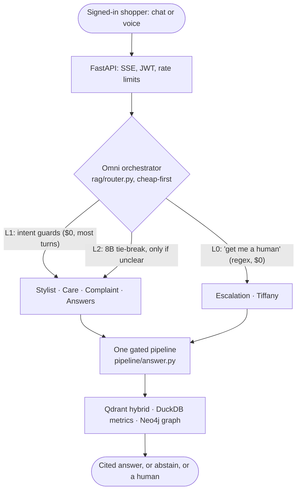

# Skein Lite

[](https://github.com/hoomanesteki/agentic-rag-knowledge-ai-platform/actions/workflows/ci.yml)

**Sara** is the AI shopping assistant on Aster Athletics, a demo apparel storefront. A signed-in
shopper asks where their order is, wants a gift for their mum who loves yoga, or checks whether
the Flow Legging runs small. Sara answers from store data with citations, says so when she does
not know, and hands off to a human when it matters.

**[Read the full write-up →](https://hoomanesteki.github.io/agentic-rag-knowledge-ai-platform/)**
covers the architecture, the evaluation, the cost proof, and the MLOps loop. The site's source is
in [`showcase/`](showcase/).

## What a shopper gets

| The shopper says | What happens |
| --- | --- |
| "Where's my order?" | Their signed-in identity unlocks their own orders, and only theirs |
| "A gift for my mum who loves yoga, around $60" | Picks from the catalog with a one-line reason each, budget respected |
| "Does the Flow Legging run small?" | A cited answer from real reviews, critical ones included |
| "What's your return policy?" | A grounded policy answer, drafted cheap, gated before it ships |
| "My order is late and I'm annoyed" | The complaint lane: empathy first, then a concrete make-right step |
| "Get me a human" | Tiffany gathers the details and files a ready case for a person |

## The numbers

| Measure | Value |
| --- | --- |
| Test suite (fully offline) | 555 |
| Golden eval set | 121 graded items; it gates every cost-motivated model flip |
| Routing, deterministic layers only | 81.6% of 350 labeled turns, at zero model cost |
| Routing with the 8B tie-break | 85.9%, with 100% escalation recall |
| Routing with a 70B tie-break | 85.3%, no better, so the cheap model routes |
| Cost per text turn | $0.0031, vs $1.3333 for a human turn: 430x |
| Catalog | 158 products, 578 variants |

Source of truth: [`evaluation/reports/site_stats.json`](evaluation/reports/site_stats.json). The
site reads the same file, so a number never drifts from its evidence.

## Architecture at a glance



One deterministic orchestrator, one answer path. The cascade in `rag/router.py` decides most
turns for free and pays for a small-model call only on genuine ambiguity. Every lane answers
through the single gated pipeline in `pipeline/answer.py`, so no lane gets a weaker safety
surface. An earlier LangGraph agent brain was retired in favour of this.

## How it stays honest

Hallucination defense is layered:

1. **A per-citation grounding check** on every answer, in the request path.
2. **An online faithfulness ladder** (`mlops/faithfulness.py`): sampled live answers are scored
   by RAGAS with a different-family judge (gpt-oss-120b judging llama output), offline, so it
   never blocks streaming. Every low-grounding turn is checked, plus a spot-check of the rest.
3. **Abstain or escalate.** Thin evidence gets "I don't have enough information" or a handoff,
   never a guess.

The riskiest behaviours are deterministic gates that run before the model sees anything, all in
`pipeline/answer.py` and covered by tests:

- **Order PII needs name plus email.** Both must appear in the shopper's own words, and a name
  token derivable from the email does not count as a second factor. An unverified order document
  is dropped before it reaches the prompt.
- **Prompt injection is refused, not resisted.** Extraction and override attempts get a
  deterministic refusal before retrieval; retrieved text is sanitized and framed as data.
- **Customer enumeration is refused.** "Who bought X" and "list your customers" are declined
  before retrieval.

Models are Groq only: llama-3.3-70b is the workhorse, llama-3.1-8b routes, drafts, and repairs
typos; Cohere `embed-v4.0` and `rerank-v3.5` do retrieval. A gpt-oss-120b generation swap
(roughly 70% cheaper) was held: a live A/B measured a faithfulness regression
([`evaluation/reports/gpt_oss_swap_ab.json`](evaluation/reports/gpt_oss_swap_ab.json)), and the
121-item golden set gates every such flip.

## Human-gated MLOps

Nothing self-ships. The loop is detect, notify, propose, and a person decides:

1. Drift monitors read the trace store (`make drift`).
2. A signal becomes **one deduped GitHub issue** (`mlops/notify.py`), the page and the audit
   trail in one thread.
3. A candidate is registered **only when a quality signal warrants it** (`make ct`).
4. A human runs **shadow replay**, champion vs challenger on real traffic (`make shadow`).
5. A human promotes (`make registry-promote`). There is no auto-promote path in CI or the serving loop.

The data lifecycle is human-triggered the same way: `make consolidate` proposes a knowledge pack
distilled from real conversations, staleness checks propose a refresh, and a person approves both.

## One engine, any store

A domain is a config folder (`domains/<name>/`): seed data plus a manifest, never engine code.
The demo ships `apparel_ecommerce`. A leak linter in `make check` fails the build if a single
brand, product, or metric name reaches an engine folder, which is what keeps the swap honest.

## MCP: the same brain, a second client

The store's assistant is also an [MCP](https://modelcontextprotocol.io/) server, so Claude Desktop,
Claude Code, or any MCP client can use Sara's tools directly. It is a thin second client of the
exact same gated pipeline the website calls, not a parallel copy: every deterministic gate (order
PII, injection, enumeration, grounding) still runs below it.

```bash
claude mcp add skein -- uv run python -m mcp_server.server    # or: make mcp
```

| Tool | What it does | Safety |
| --- | --- | --- |
| `skein_ask` | A grounded, cited answer from store data | Order and account disclosure is blocked, so a name and email in the question returns nothing |
| `skein_search_products` | Search the catalog by text, gender, price | Reads the governed gold catalog, read-only |
| `skein_get_product_facts` | One product's price, sizes, reviews | Read-only |
| `skein_get_metric` / `skein_list_metrics` | Run a governed metric by name | Name-validated against `metrics.yaml`; a single read-only SELECT, no free-form SQL |

Read-only by construction: there is no write, admin, login, or order-lookup tool, and `skein_ask`
drops every order and account document before generation, so no MCP client can reach a shopper's
private data even by supplying a real name and email (stricter than the signed-out web flow, where
that unlocks orders). stdio is the default transport; an HTTP mount and OAuth are the documented
enterprise scale-up, and no tool code changes when they are added. Full write-up on the
[MCP page](https://hoomanesteki.github.io/agentic-rag-knowledge-ai-platform/mcp.html).

## Run it

Needs [uv](https://docs.astral.sh/uv/) (it manages Python 3.12) and Docker.

```bash
make setup                 # venv + locked dependencies
make check                 # lint, 555 tests, leak check, eval gate: fully offline, no keys
cp .env.example .env       # add GROQ_API_KEY and COHERE_API_KEY for real answers
make up                    # Qdrant, Postgres, Neo4j, MLflow in Docker
make dbt-build && make ingest && make graph-load
make serve                 # API on :8000
cd web && npm install && npm run dev    # storefront on :3000
```

Sign in as the demo shopper (`demo` / `Canada54321`) and talk to Sara. `make doctor` explains
anything missing (Docker, `.env`, keys). `make reproduce` runs the whole offline verification in
one command.

## More

- **Architecture end to end:** [docs/ARCHITECTURE.md](docs/ARCHITECTURE.md)
- **Every provider's fallback chain:** [docs/fallbacks.md](docs/fallbacks.md)
- **Model selection, with evidence:** [docs/model-selection.md](docs/model-selection.md)
- **The semantic layer and dbt governance:** [docs/semantic-layer.md](docs/semantic-layer.md)
- **Deploy:** [docs/DEPLOY.md](docs/DEPLOY.md)
- **Notebooks:** [notebooks/](notebooks/) walk the data architecture and the eval step by step

## Development

Short-lived `build/<step>` branches, merged to `main` only when `make check` is green and an
independent review has passed. CI runs the same checks plus the dbt build and governance tests,
the web build, and dependency audits on every change.
